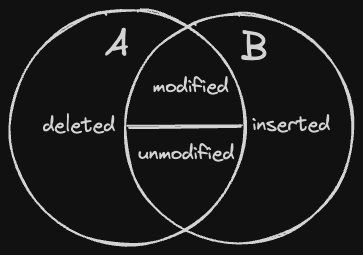

When differencing two relationships A and B, there are four cases to consider.

- inserted -- the row exists in B but not in A.
- deleted -- the row exists in A but not in B.
- unmodified -- the row exists in both, and the data is the same.
- modified -- the row exists in both, and the data is different.

Note we define "existing" as "the key appears in the table".




Here's the SQL incantations for each of these. We'll create two rows for
each of the cases.

```sql
CREATE TABLE A(key text, val int);
CREATE TABLE B(key text, val int);
insert into a(key, val) values ('a',1),('b',2),('c',3),('w',11),('x',22),('y',33);
insert into b(key, val) values ('a',9),('c',3),('d',4),('w',55),('y',33),('z',44);
```

Inserted and Deleted rows use almost the same SQL, just reversing the sense of the
LEFT JOIN and RIGHT JOIN.

```sql
-- Deleted
select a.key, a.val from a left join b on a.key = b.key where b.key is null;
┌─────────┬───────┐
│   key   │  val  │
│ varchar │ int32 │
├─────────┼───────┤
│ b       │     2 │
│ x       │    22 │
└─────────┴───────┘

-- Inserted
select b.key, b.val from a right join b on a.key = b.key where a.key is null;
┌─────────┬───────┐
│   key   │  val  │
│ varchar │ int32 │
├─────────┼───────┤
│ d       │     4 │
│ z       │    44 │
└─────────┴───────┘
```

Likewise, modified and unmodified rows are similar:  an inner joint, but differing
only on the equality check in the WHERE clause.

```sql
-- Unmodified Rows
select a.key, a.val from a inner join b on a.key=b.key where a.val = b.val;
┌─────────┬───────┐
│   key   │  val  │
│ varchar │ int32 │
├─────────┼───────┤
│ c       │     3 │
│ y       │    33 │
└─────────┴───────┘

-- Modified Rows
select b.key, b.val from a inner join b on a.key=b.key where a.val <> b.val;
┌─────────┬───────┐
│   key   │  val  │
│ varchar │ int32 │
├─────────┼───────┤
│ a       │     9 │
│ w       │    55 │
└─────────┴───────┘
```

We can also combine and process all four cases as an OUTER JOIN.

```sql
-- All cases in one statement.
SELECT 
    CASE 
        WHEN a.val <> b.val THEN 'modified'
        WHEN b.key IS NULL THEN  'deleted'
        WHEN a.val = b.val THEN  'unmodified'
        ELSE                     'inserted'
    END AS operation,
    COALESCE(a.key, b.key) AS key,
    a.val AS a_val,
    b.val AS b_val
FROM 
    a
FULL OUTER JOIN 
    b ON a.key = b.key
ORDER BY 
    COALESCE(a.key, b.key);
┌────────────┬─────────┬───────┬───────┐
│ operation  │   key   │ a_val │ b_val │
│  varchar   │ varchar │ int32 │ int32 │
├────────────┼─────────┼───────┼───────┤
│ modified   │ a       │     1 │     9 │
│ deleted    │ b       │     2 │       │
│ unmodified │ c       │     3 │     3 │
│ inserted   │ d       │       │     4 │
│ modified   │ w       │    11 │    55 │
│ deleted    │ x       │    22 │       │
│ unmodified │ y       │    33 │    33 │
│ inserted   │ z       │       │    44 │
└────────────┴─────────┴───────┴───────┘
```

Note that if you have multiple columns in your key, you can specify them as
`(key1, key2, ...)`, etc.

```sql
select a.key, a.val from a inner join b
    on (a.key1, a.key2) = (b.key1, b.key2) where a.val = b.val;
```
